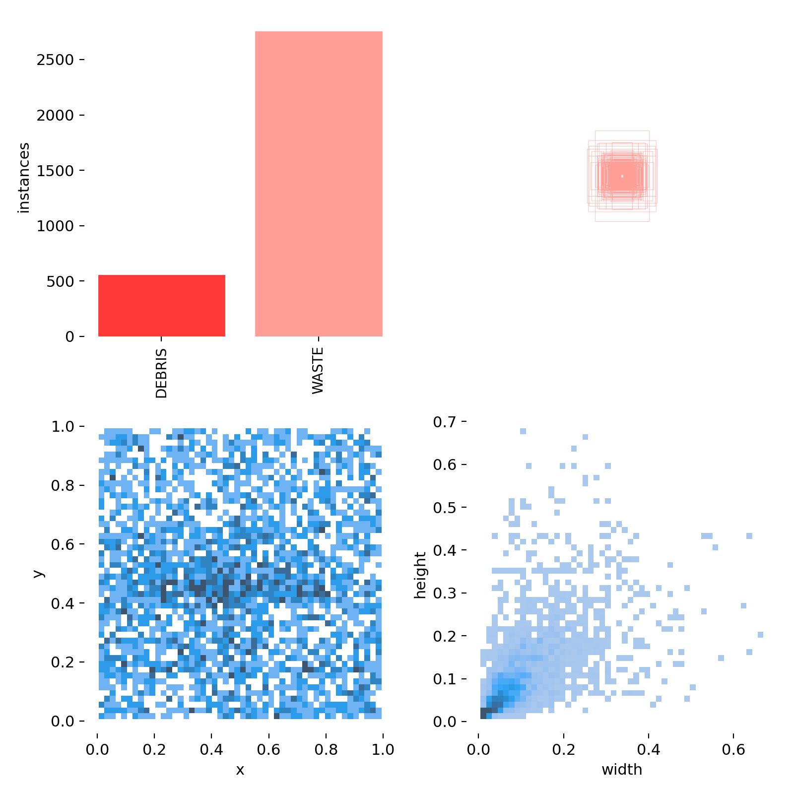

## Dataset
Il dataset utilizzato in questo progetto è stato creato con immagini proprietarie e con immagini reperite da RoboFlow Universe.
In particolare sono stati combinati [FloW-Img](https://orca-tech.cn/en/datasets/FloW/FloW-Img) e [WCB5G](https://universe.roboflow.com/ipsa-4wlge/wcb5g/dataset/17).

Le annotazioni sono state standardizzate in due categorie
- Waste
- Debris

Viene utilizzato il formato YOLO per le annotazioni.\
Il file *.txt deve essere formattato con una riga per ciascun oggetto nella classe nel formato `class x_center y_center width height`.\
Le coordinate della bounding box devono essere nel formato normalizzato xywh (da 0 a 1). Se le coordinate dei box sono espresse in pixel, è necessario dividere x_center e width per la larghezza dell'immagine e y_center e height per l'altezza dell'immagine. I numeri di classe devono essere indicizzati a partire da zero (iniziare con 0).

Il dataset ottenuto si presenta così composto:

## TODO: Object Detection
descrivere ad alto livello il funzionamento di yolo

https://www.superannotate.com/blog/yolov1-algorithm

https://www.youtube.com/watch?v=ag3DLKsl2vk

## Results
### Qualitative Results
<iframe src="https://drive.google.com/file/d/10ekzZcGs1jR9ETdi9BnN0Q_v4XKn8T6O/preview" width="640" height="480" allow="autoplay"></iframe>

### Quantitative Results
[fonte: Metrics for object detection](https://github.com/rafaelpadilla/Object-Detection-Metrics)

Le metriche di object detection fungono da misura per valutare le prestazioni del modello in un compito di rilevamento degli oggetti. Utilizziamo il concetto di Intersection over Union (IoU).

L'IoU misura la sovrapposizione tra due bounding box.

Dove "Area of Intersection" è l'area in cui le due bounding box si sovrappongono, e "Area of Union" è l'area totale coperta da entrambe le bounding box. L'IoU fornisce un valore compreso tra 0 e 1, dove 0 indica nessuna sovrapposizione e 1 indica una sovrapposizione completa.
Possiamo determinare se il rilevamento è corretto (True Positive) o meno (False Positive) applicando una soglia.
- ✅ **True Positive (TP)**: A correct detection. Detection with IOU ≥ threshold\
The model __predicted__ a label and the entity associated with the
label __was present__ in the image.
- ❌ **False Positive (FP)**: A wrong detection. Detection with IOU < threshold\
The model __predicted__ a label and entity associated with the label
__was not present__ in the image.
- ❌ **False Negative (FN)**: Oggetto non rilevato dal modello ma effettivamente presente nel ground truth\
The model __didn't predict__ a label and the entity associated with the label __was present__ in the image.
- ✅ **True Negative (TN)**: Non rilevante.
Rappresenta i casi in cui il modello identifica correttamente che non c'è alcun oggetto nella bounding box e lo classifica correttamente come background.\
The model __didn't predict__ a label and the entity associated with the label __was not present__ in the image.\
Nell'ambito dell'object detection, ci sono molte bounding box possibili che non dovrebbero essere rilevate all'interno di un'immagine. Quindi, i TN sarebbero tutte le possibili bounding box che sono state correttamente non rilevate (quindi molte possibili box all'interno di un'immagine).

#### Confusion matrix
[fonte: Metrics for object detection](https://www.researchgate.net/publication/369488541_YOLO-Based_Light-Weight_Deep_Learning_Models_for_Insect_Detection_System_with_Field_Adaption#pf13)
The confusion matrix is a method for summarizing a classification algorithm’s performance. The diagonal line shows the significance of the prediction outcomes in theconfusion matrix; the horizontal and vertical lines represent false negatives and false positives, respectively.

La **precisione** è definita come
$$ P = {TP \over TP + FP} = {TP \over all\; detection}$$
Il denominatore rappresenta il numero totale di bounding box proposte dal modello.
La precisione è la capacità di un modello di identificare solo gli oggetti rilevanti. È la percentuale di predizioni positive corrette.

Il **recall** è definita come
$$ R = {TP \over TP + FN} = {TP \over all\; ground\; truth}$$
Il denominatore rappresenta il numero di bounding box presenti nel ground truth.
Rappresenta la capacità del modello di trovare tutti i casi rilevanti (tutte le bounding box della ground truth). È la percentuale di predizioni positive corrette rilevate tra tutte quelle del ground truth.

#### Precision × Recall Curve
La curva Precision x Recall è una metrica utilizzata per valutare le prestazioni di un modello al variare della soglia di confidenza (score minimo di un oggetto per essere considerato come detection [fonte](https://pub.towardsai.net/understanding-hyper-parameter-tuning-of-yolos-82aec5f6e7b3)),
Un modello di object detection è considerato buono se per una classe specifica la sua precisione rimane alta all'aumentare del recall, il che significa che, variando la soglia di fiducia, la precisione e il recall rimarranno comunque alti.

#### Average Precision
Ulteriore metrica per valutare le performance di un modello consiste nel calcolare l'area sotto la curva curva Precision × Recall.\
Poiché le curve di P/R sono spesso  a zigzag, confrontare diverse curve (diversi modelli) nello stesso grafico di solito non è un compito facile, perché le curve tendono ad intersecarsi molto frequentemente. Ecco perché la Precisione Media (AP), una metrica numerica, può anche aiutarci a confrontare diversi modelli. In pratica, l'AP è la precisione media su tutti i valori di richiamo compresi tra 0 e 1.
Una volta ottenuta la precisione media per ogni classe, si calcola la **Mean Average Precision (mAP)** su $n$ classi come $$ mAP = {1 \over n}{\sum_{i=1}^{n} AP_{i}} $$

### Box precision vs Confusion Matrix
 Box precision measures the accuracy of predicted bounding boxes compared to the actual ground truth boxes using IoU(Intersection over Union) as the metric. 
Confusion matrix precision, on the other hand, focuses on overall classification accuracy across all classes and does not consider the geometric accuracy of predictions. It's important to note that a bounding box can be geometrically accurate (true positive) even if the class prediction is wrong, leading to differences between box precision and confusion matrix precision. These metrics evaluate distinct aspects of a model's performance, reflecting the need for different evaluation metrics in various tasks.

### Considerazioni
L'obbiettivo principale è massimizzare l'identificazione dei rifiuti a costo di tollerare alcuni falsi positivi (ad esempio, identificare erroneamente detriti come rifiuti),
è opportuno concentrarsi principalmente sul massimizzare il richiamo.
In this case, you would want to optimize for recall. This metric measures, for all the predictions made, how much is being left out. A high-recall model is likely to label marginally relevant examples, which is useful for cases where your category has scarce training data.